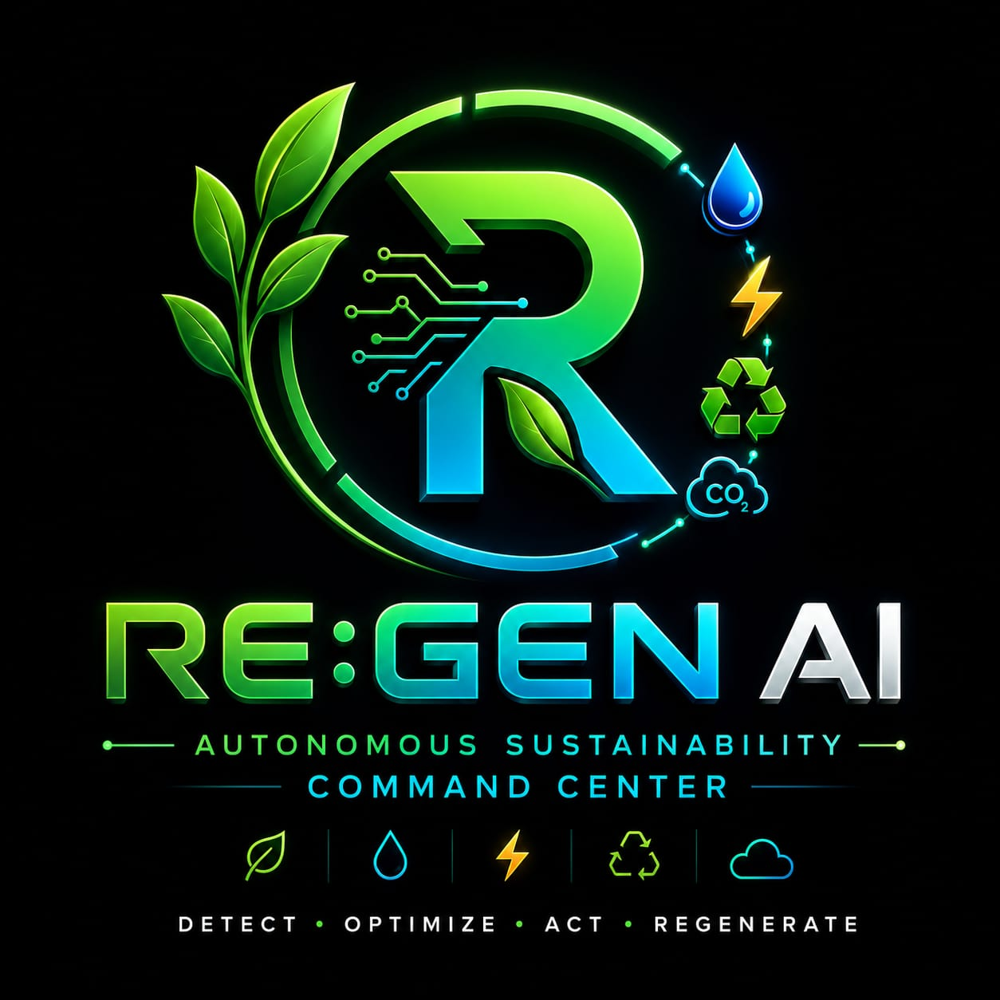
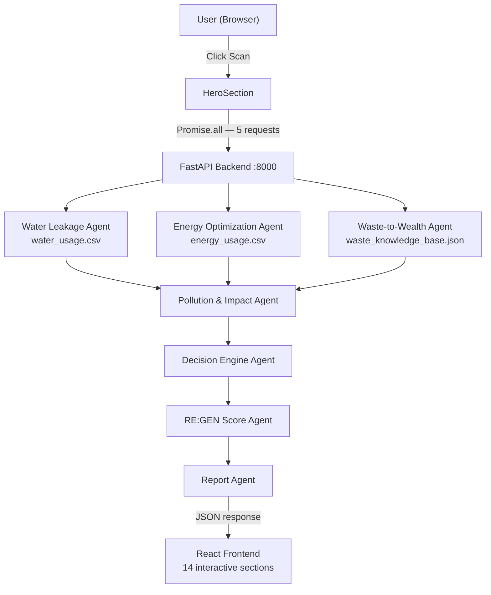
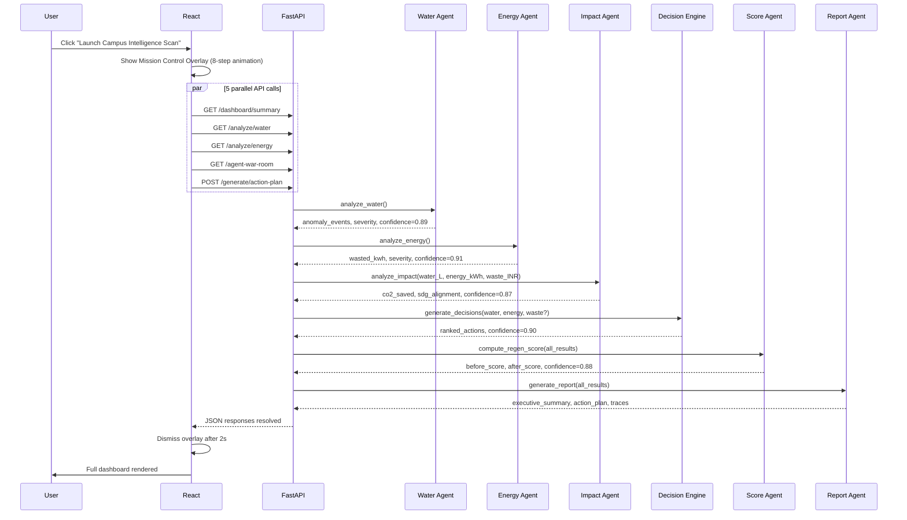
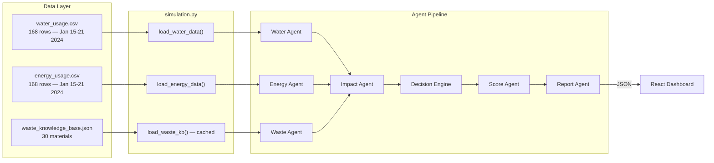

<p align="center">
  
</p>

<h1 align="center">RE:GEN AI — Autonomous Sustainability Command Center</h1>

<p align="center">
  A multi-agent decision-support prototype that detects hidden resource loss in simulated smart-campus
  sensor logs, maps waste-to-value pathways, and generates agent-prioritized sustainability interventions.
</p>

<p align="center">
  
  
  
  
  
  
  
</p>

---

## What It Does

Seven specialized agents analyze simulated 7-day campus sensor logs across water, energy, and waste.
They collaborate through a structured pipeline to produce ranked interventions, a composite RE:GEN Score (0-100),
and a 4-tier executive action plan.

**RE:GEN AI sends agents, not alerts.**

---

## System Architecture



---

## Request Flow



---

## Data Flow



---

## Features

### Waste Intelligence
- **30-material knowledge base** — Agricultural, Organic, Industrial, Metal, Plastic, Glass, Hazardous
- **Three-pathway comparison** — Sell raw (1.0x), Process into product (1.8x), Partner with recycler (1.3x)
- **Hazard guardrails** — e-waste, battery waste, medical waste trigger CPCB notice + suppress all financials
- **Hidden value score** — Each material rated 0-100 for recovery potential
- **7-step reasoning trace** — Auditable step-by-step explanation of every recommendation

### Water Intelligence
- **Night-flow anomaly detection** — Scans hours 0-5 against baseline; flags readings 4x above normal
- **Event grouping** — Anomalies grouped by date and location with duration and wasted volume
- **Cost + carbon** — Rs 0.05/L, 0.001 kg CO2/L
- **Severity tiers** — critical >1000 L · high >500 L · medium >200 L · low >50 L · none

### Energy Intelligence
- **After-hours detection** — Hours 22-23 (10-11 PM) and 0-5 (midnight-6 AM)
- **Zone-level grouping** — Events by date and zone with equipment type
- **India grid CO2** — 0.82 kg/kWh, Rs 8.00/kWh tariff
- **Severity tiers** — critical >200 kWh · high >100 · medium >50 · low >10 · none

### Cross-Domain Impact
- **CO2 aggregation** — Water + energy combined into total kg and tonne values
- **Tree equivalence** — (CO2_kg / 100) x 4.5 trees
- **SDG alignment** — SDG 6, 7, 12, 13 each with contribution statement
- **Financial benefit** — water x Rs 0.05 + energy x Rs 8 + waste_value x 0.60

### Dashboard & UI
- **Mission Control overlay** — 8-step cinematic scan, progress bar 0-100%, parallel to real API calls
- **RE:GEN Score gauges** — Animated SVG arc rings for before and after scores
- **Digital Twin Campus** — Clickable 6-building map with per-zone diagnostic detail
- **Resource Loss Heatmap** — Zone x domain risk grid with color-coded severity classes
- **30-Day Impact Projection** — Extrapolates wasted volumes (water: 85% fix rate, energy: 80%)
- **Intervention Simulator** — 6 toggles update score, savings, CO2 instantly (no backend call)
- **Sustainability Achievements** — 6 badge cards unlock dynamically from scan results
- **Agent War Room** — Live collaboration feed appends messages every 2.8s

---

## Tech Stack

| | Backend | Version |
|-|---------|---------|
| Framework | FastAPI | 0.111.0 |
| Server | Uvicorn | 0.29.0 |
| Data | Pandas | 2.2.2 |
| Validation | Pydantic | 2.7.1 |

| | Frontend | Version |
|-|----------|---------|
| UI | React | 19.2.7 |
| Build | Vite | 8.1.0 |
| Styling | Tailwind CSS v4 | 4.3.1 |
| Charts | Recharts | 3.9.0 |
| Icons | Lucide React | 1.21.0 |
| HTTP | Axios | 1.18.1 |

---

## Quick Start

**Requirements:** Python 3.11+, Node.js 18+, npm 9+

```bash
# Terminal 1 — Backend
cd backend
pip install -r requirements.txt
uvicorn main:app --reload --port 8000
```

```bash
# Terminal 2 — Frontend
cd frontend
npm install
npm run dev
```

Open: **http://localhost:5173** | API Docs: **http://localhost:8000/docs**

No environment variables. No external services. Runs entirely locally.

---

## API Endpoints

| Method | Endpoint | Agent | Description |
|--------|----------|-------|-------------|
| `GET` | `/health` | — | System status + disclaimer |
| `POST` | `/analyze/waste` | Waste-to-Wealth | Material lookup, hazard check, pathway scoring |
| `GET` | `/analyze/water` | Water Leakage | Night-flow anomaly detection on 7-day CSV |
| `GET` | `/analyze/energy` | Energy Optimization | After-hours waste detection on 7-day CSV |
| `GET` | `/dashboard/summary` | All 6 | Full pipeline — compact summary |
| `GET` | `/agent-war-room` | All 7 | Agent status panel with findings + confidence |
| `POST` | `/generate/action-plan` | All 7 | Full pipeline — unabridged report + traces |

All responses include `disclaimer` and `data_notice` fields. Full examples in [`docs/API.md`](docs/API.md).

---

## Project Structure

```
REGEN AI/
├── backend/
│   ├── main.py              # 7 FastAPI routes, CORS, Pydantic models
│   ├── requirements.txt     # fastapi, uvicorn, pandas, pydantic, python-multipart
│   ├── agents/              # 7 agent modules (one file per agent)
│   ├── core/
│   │   ├── scoring.py       # RE:GEN Score formula + severity_label()
│   │   ├── guardrails.py    # Hazard suppression, quantity validation, disclaimer
│   │   └── simulation.py    # CSV and JSON loaders
│   └── data/
│       ├── water_usage.csv
│       ├── energy_usage.csv
│       └── waste_knowledge_base.json
└── frontend/
    ├── vite.config.js       # Tailwind v4 plugin; /api proxy to localhost:8000
    ├── package.json
    └── src/
        ├── App.jsx           # Scan state, Mission Control overlay, 14 sections
        ├── api.js            # 7 Axios functions
        ├── index.css         # Glassmorphism system, 14 keyframe animations
        └── components/       # 15 components
```

---

## 7 Agents — Summary

| # | Agent | File | Confidence | Key Output |
|---|-------|------|-----------|-----------|
| 1 | Waste-to-Wealth | `waste_agent.py` | 0.92 | Recovery pathway, hidden value score, hazard check |
| 2 | Water Leakage | `water_agent.py` | 0.89 | Anomaly events, wasted litres, 5-tier severity |
| 3 | Energy Optimization | `energy_agent.py` | 0.91 | After-hours kWh waste, CO2 at 0.82 kg/kWh |
| 4 | Pollution & Impact | `impact_agent.py` | 0.87 | Total CO2, trees equivalent, SDG alignment |
| 5 | Decision Engine | `decision_agent.py` | 0.90 | Ranked actions by urgency x cost x env x feasibility |
| 6 | RE:GEN Score | `regen_score_agent.py` | 0.88 | Before/after score, 6 sub-dimension breakdown |
| 7 | Report | `report_agent.py` | 0.95 | Executive summary, 4-tier action plan, all traces |

Each agent returns a `reasoning_trace` array (5-8 steps). Full specs in [`docs/AGENTS.md`](docs/AGENTS.md).

---

## RE:GEN Score Formula

```
RE:GEN Score = waste  x 0.20
             + water  x 0.20
             + energy x 0.20
             + CO2    x 0.15
             + urgency x 0.15
             + feasibility x 0.10
```

Result clamped 0-100. Ratings: **>=80 Excellent · >=60 Good · >=40 Moderate · >=20 Poor · <20 Critical**

The dashboard shows a **before score** (current degraded state with 15-25pt penalties applied)
and **after score** (if all recommended actions are fully implemented).

**Decision Engine ranking formula:**

```
priority_score = urgency x 0.35
              + min(cost / 1000, 30) x 0.30
              + env_impact x 0.25
              + feasibility x 0.10
```

---

## Guardrails

| Guardrail | Trigger | Effect |
|-----------|---------|--------|
| Hazard suppression | `hazard_level: critical` or `high` | CPCB notice injected, all financial estimates set to null |
| Quantity validation | `quantity_kg <= 0` or `> 100,000` | HTTP 400 returned before any agent runs |
| Disclaimer injection | Every request | Prototype disclaimer + simulated data notice appended to all responses |
| Forbidden outputs | Always | Agents never claim exact profit, real-time data, or live sensor readings |

Materials that trigger hazard suppression: **e-waste**, **battery waste**, **medical waste**.

Full details in [`docs/SECURITY.md`](docs/SECURITY.md).

---

## Simulated Data

| Dataset | Rows | Locations / Zones | Key Anomalies |
|---------|------|-------------------|---------------|
| `water_usage.csv` | 168 | Campus Main, Block-B Hostel, Lab Block | Night-flow burst Jan 16 (Hostel), Jan 19 (Lab Block — CRITICAL) |
| `energy_usage.csv` | 168 | Admin Block, Seminar Hall, Computer Lab, Campus | After-hours AC Jan 16 (Seminar), Jan 19 (Computer Lab) |
| `waste_knowledge_base.json` | 30 materials | — | e-waste, battery waste, medical waste flagged critical |

All data is generated for January 15-21, 2024. No live IoT systems are connected.

---

## Google AI Agents Capstone Mapping

| Concept | Implementation | Evidence |
|---------|---------------|----------|
| Multi-Agent System | 7 specialized agents, one module each | `backend/agents/*.py` |
| Tools & Data Lookup | CSV + JSON KB retrieval via `simulation.py` | `core/simulation.py`, `data/` |
| State & Memory | Agent dicts chained through `main.py`; Report Agent aggregates full context | All orchestrated endpoints |
| Guardrails & Safety | Hazard suppression + disclaimer injection on every response | `core/guardrails.py` |
| Evaluation & Scoring | 6-dimension weighted score, per-agent confidence 0.87-0.95 | `core/scoring.py` |
| Production-Grade Structure | FastAPI + Pydantic + CORS + React + Vite + Axios | `main.py`, `frontend/src/api.js` |

Full mapping in [`docs/CAPSTONE.md`](docs/CAPSTONE.md).

---

## Documentation

| File | Contents |
|------|---------|
| [`docs/ARCHITECTURE.md`](docs/ARCHITECTURE.md) | System design, component map, CSS system, scoring formula |
| [`docs/AGENTS.md`](docs/AGENTS.md) | All 7 agents — inputs, process, outputs, exact thresholds |
| [`docs/API.md`](docs/API.md) | All 7 endpoints with full request/response JSON |
| [`docs/FLOWCHARTS.md`](docs/FLOWCHARTS.md) | Extended Mermaid diagrams |
| [`docs/SECURITY.md`](docs/SECURITY.md) | Guardrails, disclaimer injection, production gaps |
| [`docs/CAPSTONE.md`](docs/CAPSTONE.md) | Capstone mapping, evaluation test cases, SDG alignment |
| [`docs/DEMO.md`](docs/DEMO.md) | Step-by-step walkthrough, intervention toggle guide |
| [`docs/DEPLOYMENT.md`](docs/DEPLOYMENT.md) | Local dev, production build, cloud platforms, Docker |
| [`docs/FUTURE_ROADMAP.md`](docs/FUTURE_ROADMAP.md) | Roadmap, known limitations, contributing guide |

---

## Contributing

1. Fork and create a branch: `git checkout -b feature/your-feature`
2. Backend changes in `backend/`; frontend in `frontend/`
3. New agents: add a file to `backend/agents/` and wire into `main.py`
4. Do not weaken guardrail logic in `core/guardrails.py`
5. All API responses must include `disclaimer` and `data_notice`
6. Run `cd frontend && npm run build` before opening a PR

---

## License

MIT — see [LICENSE](LICENSE).

---

> **Disclaimer:** RE:GEN AI is a prototype decision-support system built for the Google Kaggle AI Agents
> Capstone. All sensor data is simulated (January 15-21, 2024). No live IoT systems are connected.
> All cost, CO2, and recovery values are estimates — not professional regulatory, financial, or engineering advice.