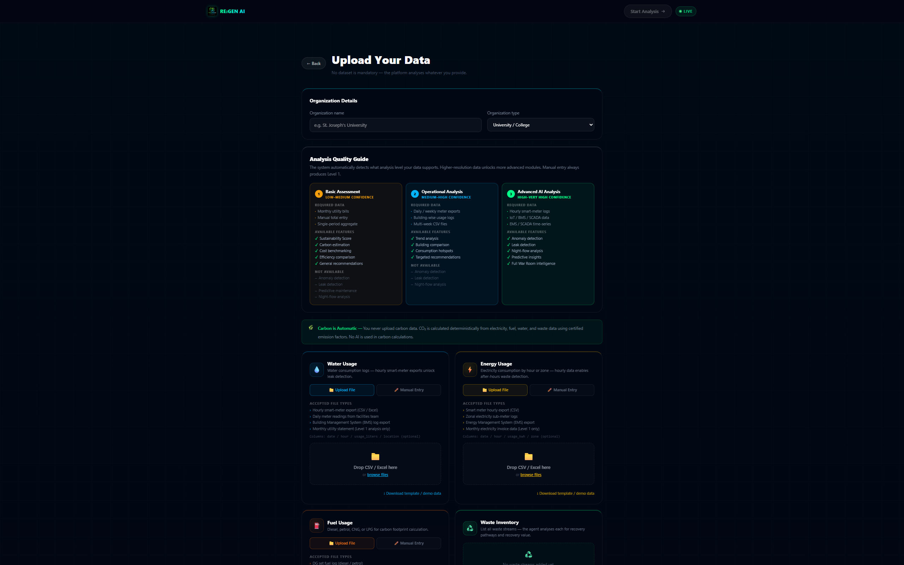
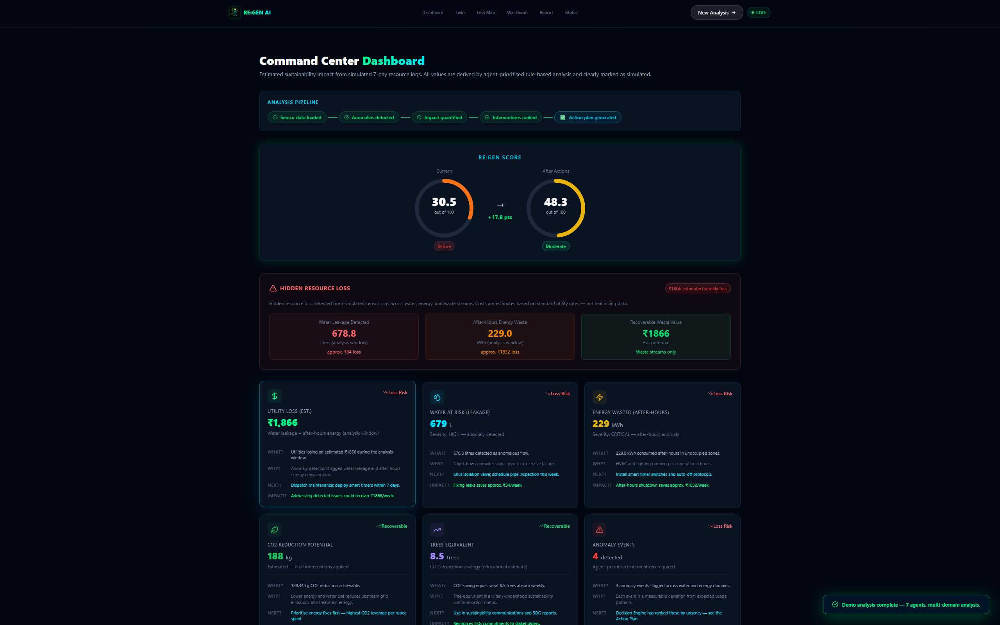
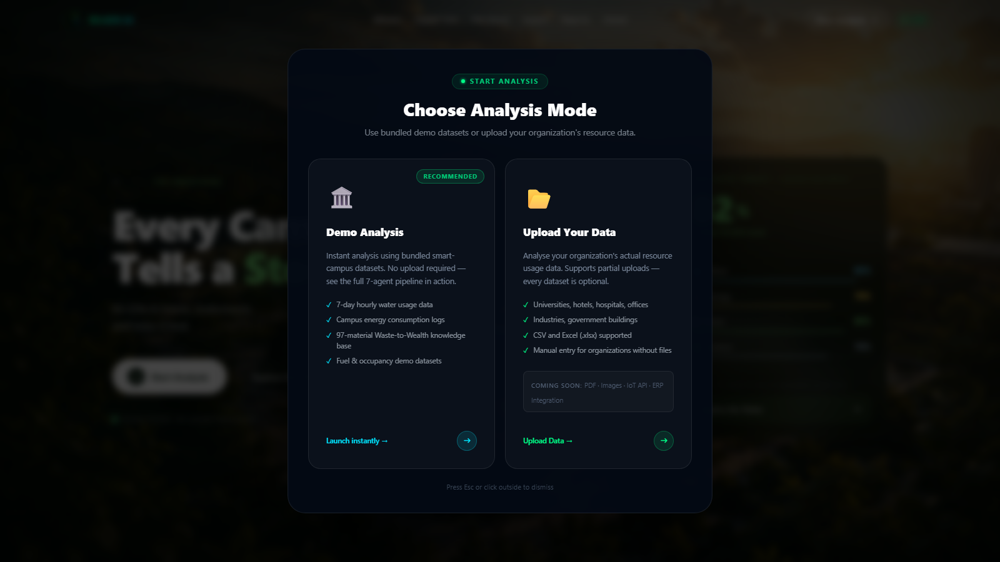
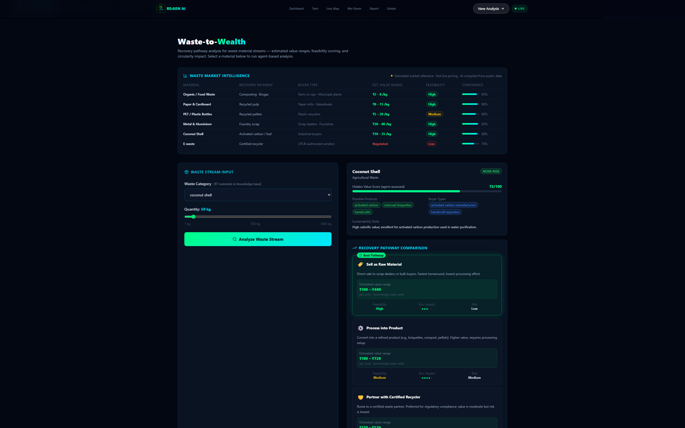
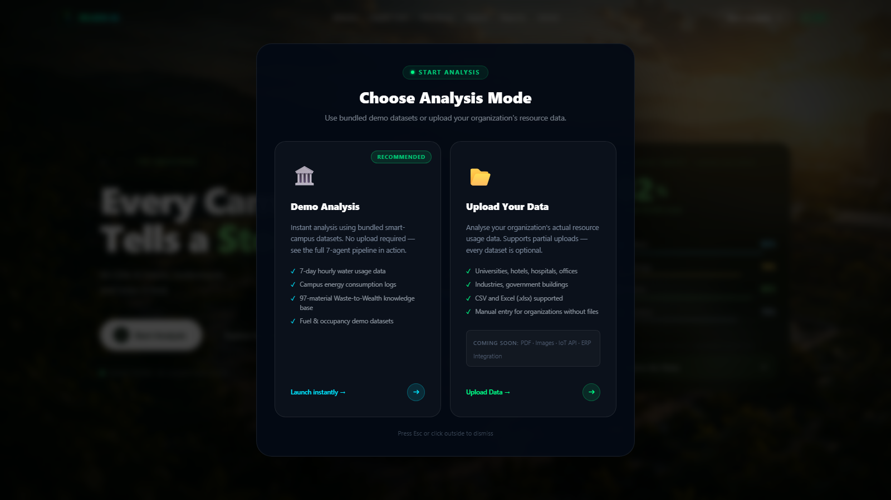

# RE:GEN AI

> **Multi-agent sustainability intelligence.** Seven specialised AI agents detect hidden resource loss, map waste streams to recovery value, and generate evidence-backed intervention plans — for any campus, hospital, hotel, or industrial facility.

**[Live Demo](https://frontend-two-rho-85.vercel.app)** · **[Backend API](https://regen-ai-backend.onrender.com/health)** · **[Demo Video](https://youtu.be/yrCC-NWa108)** · **[GitHub](https://github.com/DivyaShreeS09/RE-GEN-AI)**


---

## 🏆 ChatGPT Codex India Hackathon 2026 Submission

**Official Submission Theme:** **Theme 8 — AI for Societal Good**

**Project Domain:** Sustainability Intelligence & Environmental Resource Optimization

RE:GEN AI is officially submitted under **Theme 8 — AI for Societal Good** because the platform addresses real-world environmental and sustainability challenges through AI-powered decision support, helping organizations improve resource efficiency, reduce environmental impact, and make more sustainable operational decisions.

The project demonstrates how collaborative AI systems can support hospitals, educational institutions, industries, commercial buildings, campuses, smart cities, governments, and other organizations by transforming fragmented sustainability data into transparent, explainable, and actionable recommendations.

While the official submission theme is **AI for Societal Good**, the engineering architecture also closely aligns with **Theme 4 — Domain Agents**. The platform is implemented as a collaborative multi-agent system where seven specialized AI agents work together across waste analysis, water intelligence, energy optimization, environmental impact assessment, decision intelligence, sustainability scoring, and executive reporting.

This combination demonstrates both meaningful societal impact and a practical domain-specific AI workflow while showcasing genuine agentic software engineering with OpenAI Codex.

Throughout development, OpenAI Codex was used as an engineering assistant for:

- System architecture planning
- Multi-agent workflow design
- Implementation planning
- Engineering review
- Code quality improvements
- Debugging and iterative refinement
- Repository auditing
- Quality assurance
- Release readiness verification

The final software architecture, sustainability methodology, engineering decisions, implementation, testing, deployment, documentation, and integration were completed by the developer.

---

## The Problem

Campuses, hospitals, hotels, and industrial facilities silently lose significant water, energy, and waste value every week — not from a lack of concern, but because the data lives in disconnected systems with no one synthesising it into action.

Night-time pipe leaks run undetected until the bill arrives. Lab equipment left on overnight drains electricity budgets. Recyclable materials accumulate in general waste because no one has mapped their recovery pathway. When an analyst finally collects the data, it takes weeks of manual work to produce even a basic sustainability report — by which time the next month's losses have already compounded.

---

## Solution

RE:GEN AI runs a coordinated network of seven specialised AI agents against your uploaded resource data. Each agent independently detects anomalies in its domain, calculates sustainability impact, and contributes findings to a shared decision pipeline. The Decision Engine ranks interventions by urgency, estimated cost savings, and environmental impact. OpenAI `gpt-4o-mini` adds a narrative reasoning layer — explaining priority decisions in plain language — while all numerical analysis remains fully deterministic and auditable.

**Two modes.** Demo mode runs instantly on bundled sensor data. Upload mode accepts your organisation's CSV, Excel, or manually entered figures for any combination of water, energy, fuel, and waste datasets.

---

## Key Features

| | | |
|---|---|---|
| **Multi-Agent AI** — Seven specialised agents run in parallel, each owning a distinct resource domain | **Three Analysis Levels** — Auto-detected from data resolution; confidence calibrated honestly to what the data supports | **Upload + Demo Modes** — Upload your own CSV/Excel data or explore instantly with bundled sensor logs |
| **Digital Twin** — Facility visualisation at the correct analysis level: resource nodes (L1), zone archetypes (L2), or anomaly-driven map (L3) | **Agent War Room** — Live agent reasoning, findings, skip reasons, and confidence levels — all from real backend data in upload mode | **97-Material Waste KB** — Production knowledge base: 15 categories, 100+ alias normalisations, Indian regulatory compliance notes |
| **RE:GEN Score** — Weighted sustainability health index before and after interventions | **Action Plan + PDF** — Ranked intervention stack with estimated savings, exported via browser print API | **Carbon Calculator** — Scope 1+2 CO₂ formula using IPCC 2006 and BEE India emission factors, shown inline with sources |
| **OpenAI Integration** — Narrative layer with deterministic fallback; no analysis fails without a key | **Graceful Degradation** — Missing datasets produce a skip with an explanation, never a crash | **Honest Disclosure** — Anomaly detection availability explicitly surfaced everywhere it matters |

---

## Architecture

```
┌─────────────────────────────────────────────────────────────┐
│                    Data Intelligence Layer                   │
│   Upload CSV / Excel  ·  Manual Entry  ·  Schema Validation  │
│   Coverage %  ·  Confidence %  ·  Analysis Level (1 – 3)    │
└──────────────────────────┬──────────────────────────────────┘
                           │
           ┌───────────────▼───────────────┐
           │        Multi-Agent Core        │
           │    FastAPI  ·  Python 3.11+    │
           └──┬────┬────┬────┬────┬────┬───┘
              │    │    │    │    │    │
         ┌────▼──┐ │ ┌──▼─┐ │ ┌──▼─┐ │ ┌────▼───┐
         │ Water │ │ │Enrg│ │ │Wste│ │ │ Impact │
         │ Agent │ │ │ Ag │ │ │ Ag │ │ │  Agent │
         └───────┘ │ └────┘ │ └────┘ │ └────────┘
              ┌────▼──┐  ┌──▼─────┐  ┌─────▼──┐
              │Decisn │  │ RE:GEN │  │ Report │
              │Engine │  │ Score  │  │  Agent │
              └───────┘  └────────┘  └────────┘
                           │
           ┌───────────────▼───────────────┐
           │        OpenAI gpt-4o-mini      │
           │   Narrative  ·  Explanations   │
           │  (deterministic KB fallback)   │
           └───────────────┬───────────────┘
                           │
           ┌───────────────▼───────────────┐
           │          React Frontend        │
           │  Dashboard  ·  Digital Twin    │
           │  War Room  ·  Waste-to-Wealth  │
           │  Action Plan  ·  PDF Export    │
           └───────────────────────────────┘
```

---

## Agent Pipeline

```
  Upload / Demo
       │
       ▼
  Schema Validation ──► Analysis Level Detection (L1 / L2 / L3)
       │
       ├──────────────────────────────────────────────┐
       │                                              │
       ▼                                              ▼
  Water Leakage Agent              Energy Optimization Agent
  Waste-to-Wealth Agent            Pollution & Impact Agent
       │                                              │
       └──────────────────┬───────────────────────────┘
                          │
                          ▼
                  Decision Engine Agent
                  (ranks by urgency × impact × cost)
                          │
              ┌───────────┴───────────┐
              │                       │
              ▼                       ▼
       RE:GEN Score Agent       Report Agent
       (before / after)    (executive summary + action plan)
              │                       │
              └───────────┬───────────┘
                          │
                          ▼
               React Frontend
       Dashboard  ·  Digital Twin  ·  War Room
       Waste-to-Wealth  ·  Action Plan  ·  PDF
```

All agents run in parallel. No agent blocks another. A missing dataset produces a graceful skip with an explicit reason — never a crash or a silent failure.

---

## Analysis Levels

The system auto-detects data resolution from the uploaded file and adjusts every output accordingly.

| Level | Data Required | Capabilities | Confidence |
|---|---|---|---|
| **Level 1** — Basic Assessment | Manual entry or monthly totals | Sustainability score, carbon estimation, cost benchmarking | ≤ 55% |
| **Level 2** — Operational Analysis | Daily or weekly meter exports (≥ 3 days) | Trend analysis, consumption hotspots, building comparison | ≤ 72% |
| **Level 3** — Advanced AI Analysis | Hourly data, ≥ 3 days, ≥ 12 hour-slots/day | Full anomaly detection, leak detection, predictive maintenance | 85 – 95% |

When anomaly detection is unavailable, the system explicitly discloses this in the War Room, Digital Twin, every generated report, and the Mission Summary — never silently claiming to detect leaks from monthly aggregates.

---

## Waste-to-Wealth Intelligence

The Waste-to-Wealth agent uses a production-quality knowledge base of **97 materials** across 15 categories.

| Field | Description |
|---|---|
| `recommended_pathway` | Best recovery route: composting, recycling, certified handler, energy recovery |
| `estimated_value_range` | Min / max INR per kg — market reference, not a guarantee |
| `co2_savings_kg_per_tonne` | CO₂ avoidance vs landfill (LCA-sourced) |
| `compliance_notes` | Applicable regulation: SWM Rules 2016, E-Waste Rules 2022, HWM Rules 2016 |
| `required_handling` | PPE and segregation requirements |
| `preparation_before_sale` | Step-by-step actions before contacting a buyer |
| `buyer_types` | Kabadiwala, paper mill, CPCB-authorised handler, and others |
| `hazard_level` | none / low / medium / high / critical |

**Alias normalisation** — 100+ variant spellings are normalised before lookup: "PET bottles" → `pet`, "corrugated cardboard" → `cardboard`, "biomedical waste" → `medical waste`. Unknown materials receive inferred category guidance and interim handling advice — never a silent failure.

The material dropdown is generated live from `/analyze/waste/materials`. Additions to the knowledge base surface automatically with no frontend edits required.

---

## Digital Twin

The Digital Twin renders the facility at the correct analysis level — never over-claiming.

- **Level 1** — Five resource nodes (Water, Energy, Fuel, Waste, Carbon) showing actual uploaded totals; zone-level detection explicitly marked unavailable
- **Level 2** — Organisation-type zone archetypes (University, Hospital, Hotel, Factory, etc.) with proportional consumption estimates; no fabricated anomaly colouring
- **Level 3** — Full anomaly-driven zone map; risk levels derived from detected events

Carbon is always calculated automatically:

```
CO₂ = (water_L × 0.001) + (energy_kWh × 0.82) + (fuel_L × emission_factor)
```

Sources: UK Water Industry Research, BEE India, IPCC 2006. The formula breakdown and emission factors are shown inline in the Carbon node tooltip.

---

## Agent War Room

Seven agents are visualised as an animated node network. In upload mode:

- Every agent card shows real backend data: finding, reasoning, recommendation, confidence
- Skipped agents show the exact reason they were skipped and which data would re-activate them
- The Waste-to-Wealth agent shows the top recovery opportunity and estimated value range
- The live reasoning feed is built entirely from agent outputs — no hardcoded demo text can leak through

---

## OpenAI Integration

`gpt-4o-mini` is integrated at three points in the pipeline, each with a deterministic fallback:

| Point | GPT contribution | Fallback |
|---|---|---|
| Waste-to-Wealth | 2-sentence actionable guidance for the sustainability officer | Constructed from KB fields |
| War Room reasoning | Plain-language explanation of each agent's finding and priority | Rule-based template from agent output |
| Executive summary | 3-paragraph report calibrated to analysis level; discloses if anomaly detection was unavailable | Deterministic template using actual numbers |

Every financial figure is prefixed with *estimated*. No exact profit is claimed. No data is invented. If OpenAI is unavailable or rate-limited, the system degrades gracefully — no analysis fails.

---

## Data Flow

Every displayed value originates from a single backend field. No frontend recomputation when the backend has already computed it.

| Display location | Backend source |
|---|---|
| Dashboard total wasted litres | `water_result.total_wasted_liters` |
| Dashboard total wasted kWh | `energy_result.total_wasted_kwh` |
| Dashboard total CO₂ saved | `impact_result.total_co2_saved_kg` |
| Dashboard RE:GEN Score | `regen_score_result.before_score` |
| Waste recovery estimate | `waste_result.total_recovery_max_inr` |
| Carbon formula breakdown | `impact_result` + per-fuel CO₂ sub-fields |
| War Room recommendations | `war_room[].recommendation` from `/analyze/upload` |
| Report executive summary | `report_result.executive_summary` |
| PDF numbers | Same `report_result` object — no re-derivation |

---

## Technology Stack

| Layer | Technology |
|---|---|
| Frontend | React 19, Vite 8, Framer Motion, Lucide React, Tailwind CSS 4 |
| Backend | FastAPI, Python 3.11+, Pydantic v2, pandas, openpyxl |
| AI Layer | OpenAI gpt-4o-mini (with deterministic fallback) |
| Deployment | Vercel (frontend) + Render (backend) |
| Data | JSON knowledge base (97 materials) + CSV demo datasets |
| Export | Browser print API (`window.print()`) — formatted print stylesheet, no external library |

---

## Deployment

**Frontend** — Vercel (auto-deployed from `main`)  
**Backend** — Render (FastAPI, Python 3.11, auto-deployed)

```bash
# Local development
cd backend && pip install -r requirements.txt && uvicorn main:app --reload
cd frontend && npm install && npm run dev
```

Environment variables:

```
# backend/.env
OPENAI_API_KEY=sk-...        # Optional — system degrades gracefully without it

# Vercel project settings
VITE_API_URL=https://regen-ai-backend.onrender.com
```

> **Cold start** — Render's free tier sleeps after 15 minutes of inactivity. The first request after a sleep takes 30 – 90 seconds. The UI shows a specific message during this wait.

---

## Hackathon Alignment

### Technical Excellence
- Seven specialised agents with typed interfaces, deterministic calculations, and explicit confidence levels
- Three-tier analysis level system that honestly discloses data resolution limitations rather than fabricating precision
- Production-quality knowledge base: 97 materials, 100+ alias normalisations, regulatory citations
- Zero data fabrication — every displayed number traces to a single backend field
- Graceful degradation across all failure modes: missing API key, missing datasets, unknown materials, cold start

### Agentic Design
- Each agent is independently callable with typed inputs and outputs
- The Decision Engine consumes all agent outputs and produces a ranked intervention stack scored by urgency × impact × cost
- The Report Agent synthesises findings across all agents into a professional executive summary
- The War Room visualises live agent reasoning, skip reasons, and confidence levels
- OpenAI enhances deterministic outputs; it never replaces them

### Real-World Impact
- Quantifiable outputs: litres saved, kWh recovered, INR recovery estimated, CO₂ avoided
- SDG alignment: SDG 6 (Clean Water), SDG 7 (Affordable Energy), SDG 12 (Responsible Consumption), SDG 13 (Climate Action)
- Applicable to any organisation type: University, Hospital, Hotel, Factory, Airport, Mall, Office
- Waste-to-Wealth maps 97 material streams to recovery value and compliance guidance

### Honest AI
- Analysis level system calibrates confidence to actual data resolution — rare in sustainability tools
- Alias normalisation prevents false "unknown" classifications for common variant spellings
- War Room never surfaces hardcoded demo text in upload mode — all reasoning derives from real agent outputs
- Carbon formula is transparent and shown inline with component breakdown and regulatory source

---

## Screenshots

### Landing Hero


*Entry point — live demo and upload mode options, with mission status and RE:GEN Score overview.*

---

### Upload Center



*Upload CSV, Excel, or manually enter water, energy, fuel, and waste data — every dataset is optional.*

---

### Command Center Dashboard



*Real-time key metrics: total wasted litres, kWh lost, CO₂ avoided, and RE:GEN Score across all resource domains.*

---

### Digital Twin


*Facility visualised at the correct analysis level — resource nodes (L1), zone archetypes (L2), or anomaly-driven map (L3).*

---

### Agent War Room



*Seven autonomous agents — live reasoning, findings, confidence levels, and skip reasons all sourced from real backend data.*

---

### Waste-to-Wealth



*Recovery pathway analysis across 97 materials — estimated value range, CO₂ savings, and regulatory compliance guidance.*

---

### Sustainability Action Plan



*Ranked intervention stack with estimated savings, export to PDF via browser print API.*

---

## Formula Verification

| Calculation | Formula | Source |
|---|---|---|
| Water CO₂ | `litres × 0.001 kg/L` | UK Water Industry Research |
| Energy CO₂ | `kWh × 0.82 kg/kWh` | BEE India grid emission factor |
| Diesel CO₂ | `litres × 2.68 kg/L` | IPCC 2006 |
| Petrol CO₂ | `litres × 2.31 kg/L` | IPCC 2006 |
| LPG CO₂ | `litres × 1.51 kg/L` | IPCC 2006 |
| Total Carbon | `water_co2 + energy_co2 + fuel_co2` | Scope 1 + 2 |
| RE:GEN Score | Weighted composite of water / energy / carbon / waste / coverage | Internal |
| Recovery value | `quantity_kg × value_range_per_kg` | KB benchmark rates |

---

## Built with OpenAI Codex

OpenAI Codex served as the primary engineering assistant throughout the development lifecycle of RE:GEN AI.

**How Codex was used:**

- **Architecture planning** — Codex helped reason through the multi-agent pipeline structure: how seven independent agents would own separate resource domains, share a typed decision interface, and degrade gracefully when datasets are absent or incomplete.
- **Implementation planning** — Before writing each module, Codex was used to plan the implementation approach: data flow, edge cases, API contract design, and confidence calibration across three analysis levels.
- **Engineering guidance** — Codex provided guidance on FastAPI patterns, Pydantic v2 schema design, Vite proxy configuration, React hook correctness (including rules-of-hooks compliance), and vitest setup for a component test suite.
- **Code review** — Each agent, endpoint, and frontend component was reviewed through Codex to identify logic errors, unsafe patterns, and missed edge cases before committing.
- **Debugging** — Codex was used to trace and resolve issues including conditional hook order violations, `useMemo` stabilisation for stream references, prompt injection sanitisation gaps, and Pydantic deprecation warnings.
- **Iterative improvements** — The backend OpenAPI documentation (tags, summaries, docstrings), action plan transparency badges, and dynamic PDF metadata were all implemented through Codex-guided iterative refinement.
- **Quality assurance** — A 10-step independent QA audit was conducted with Codex acting as QA engineer: inspecting every endpoint, verifying stress-test responses, confirming security properties, and scoring the submission across architecture, code quality, security, and production readiness dimensions.
- **Repository review** — Codex reviewed the full repository for tracked secrets, temporary files, encoding artifacts, dead code, and release-blocking issues prior to submission.
- **Release readiness verification** — Final build verification, lint checks, full test suite execution (51 backend + 16 frontend tests), and deployment validation were performed under Codex guidance.

Throughout development, Codex acted as an engineering assistant and reviewer. All architectural decisions, domain logic, knowledge base design, and final implementation choices remained under developer control. Codex accelerated the engineering process — it did not automate it.

---

*RE:GEN AI is a decision-support prototype. Not professional regulatory, financial, or engineering advice.*
