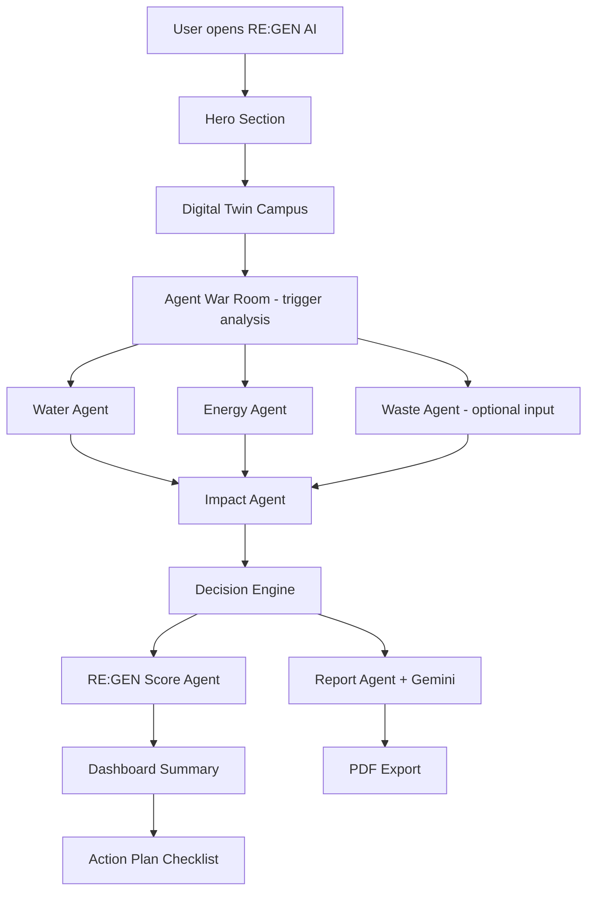
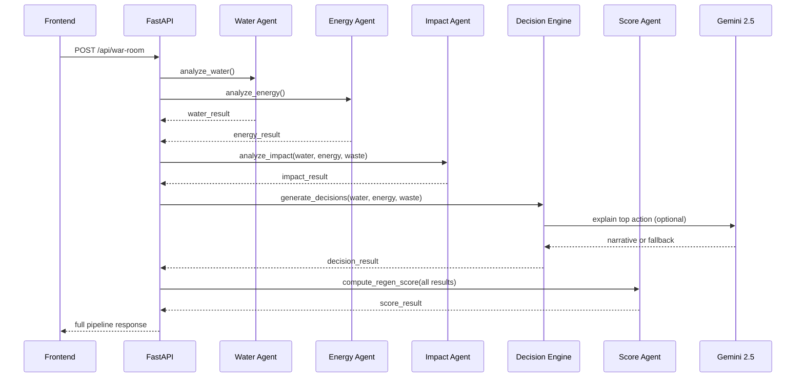
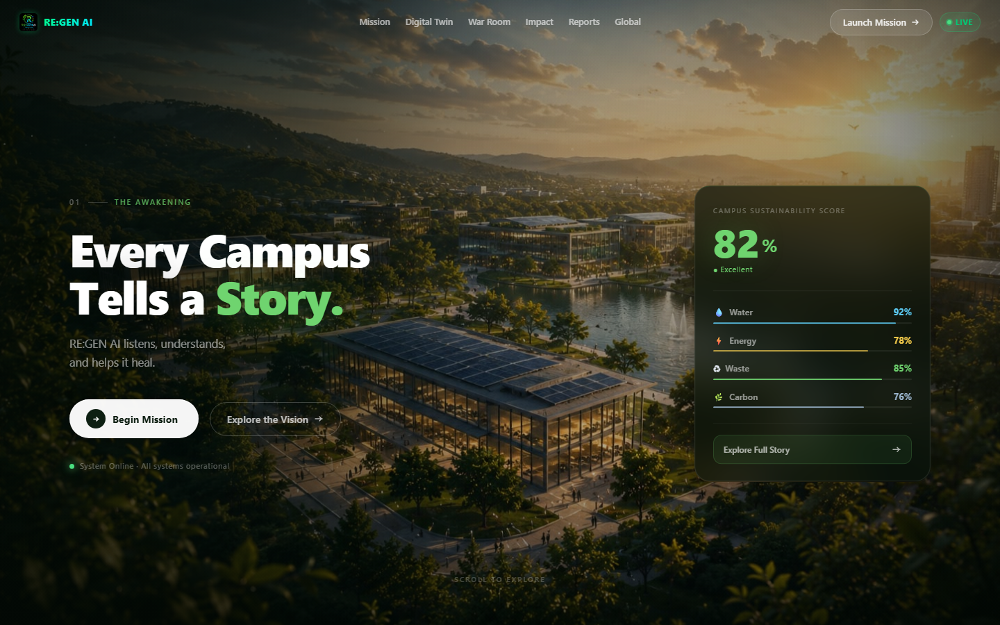
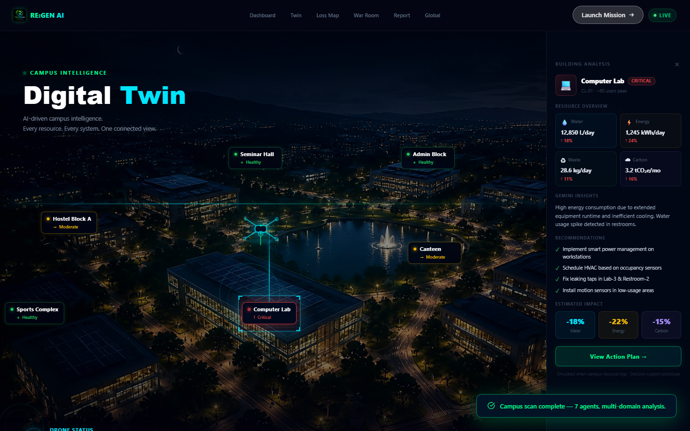
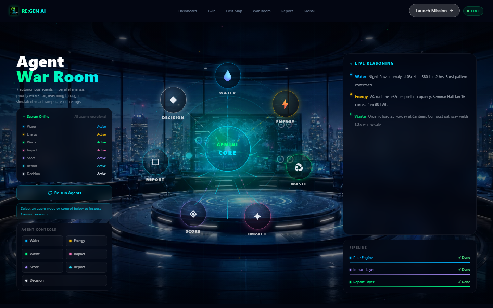
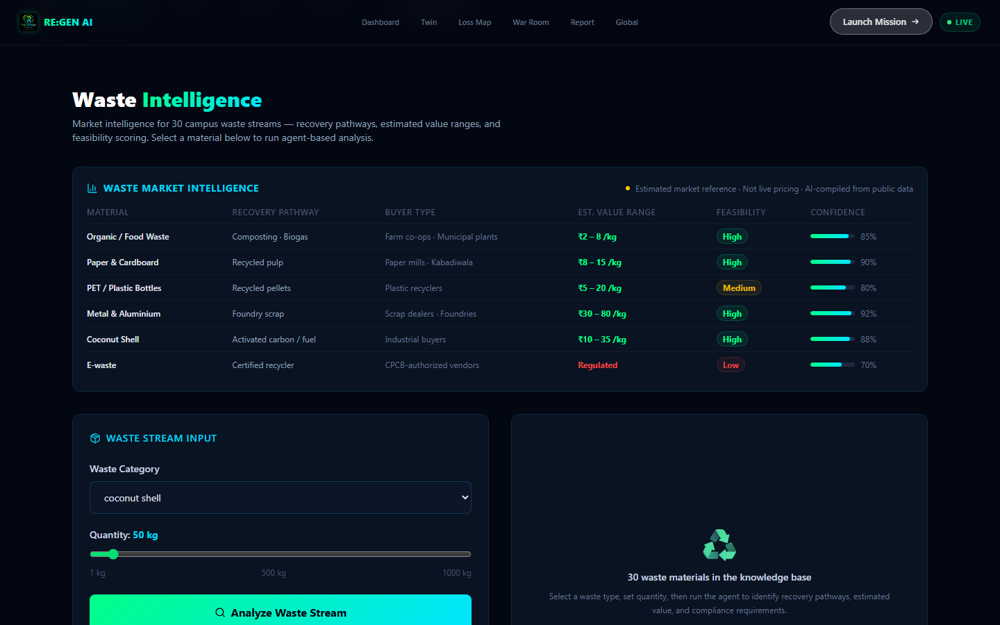
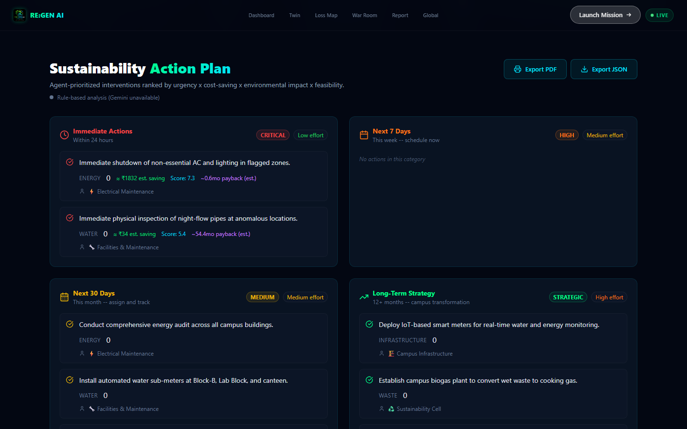

# RE:GEN AI — Multi-Agent Sustainability Command Center

> Autonomous AI agents that detect hidden campus resource loss and generate sustainability action plans.

**Google Kaggle AI Agents: Intensive Vibe Coding Capstone Project 2026**

**Live demo:** [https://frontend-two-rho-85.vercel.app](https://frontend-two-rho-85.vercel.app)  
**Backend API:** [https://regen-ai-backend.onrender.com/health](https://regen-ai-backend.onrender.com/health)

---

## The Problem

University campuses silently lose significant water, energy, and waste value every week — not because of a lack of concern, but because the data lives in disconnected systems with no one synthesizing it into action. Night-time pipe leaks run undetected until a bill arrives. Lab equipment left on overnight drains electricity budgets. Recyclable materials accumulate in general waste because no one has mapped their recovery pathway.

RE:GEN AI is a decision-support prototype that addresses this gap.

---

## What RE:GEN AI Does

RE:GEN AI runs a coordinated network of specialized AI agents against simulated smart-campus resource logs. Each agent independently detects anomalies in its domain, calculates estimated sustainability impact, and contributes findings to a shared decision pipeline. The Decision Engine then ranks interventions by urgency, estimated cost savings, and environmental impact. Gemini 2.5 Flash Lite adds a narrative reasoning layer to explain priority decisions in plain language.

**This is a prototype built for a capstone demonstration. All data is simulated.**

---

## Key Features

| Feature | Description |
|---|---|
| Digital Twin Campus | Live-updating campus visualization with per-zone resource health indicators |
| Agent War Room | Real-time agent network visualization — watch agents analyze and report |
| Waste-to-Wealth Analyzer | Maps 30 waste material types to recovery pathways and estimated value |
| Water Leakage Agent | Detects night-flow anomalies from 7-day hourly water usage logs |
| Energy Optimization Agent | Identifies after-hours energy waste across campus zones |
| Pollution & Impact Agent | Calculates CO2 savings, SDG alignment, and annual projections |
| Decision Engine | Ranks interventions by composite urgency/cost/environmental score |
| RE:GEN Score | Campus sustainability health index: before and after agent intervention |
| Gemini Narrative Layer | Enhanced recommendations and executive summary via Gemini 2.5 Flash Lite |
| PDF Report Export | Downloadable executive brief with full agent findings |
| Action Plan | Agent-prioritized intervention checklist with ROI estimates |

---

## Agent Architecture

```
                    ┌─────────────────────┐
                    │   Simulated Campus   │
                    │      Data Layer      │
                    │  (CSV / JSON / KB)   │
                    └──────────┬──────────┘
                               │
            ┌──────────────────┼──────────────────┐
            ▼                  ▼                  ▼
    ┌───────────────┐  ┌───────────────┐  ┌───────────────┐
    │  Water Agent  │  │ Energy Agent  │  │  Waste Agent  │
    │  Night-flow   │  │  After-hours  │  │ KB lookup +   │
    │  anomaly det. │  │  waste detect │  │ hazard guard  │
    └───────┬───────┘  └───────┬───────┘  └───────┬───────┘
            └──────────────────┼──────────────────┘
                               ▼
                    ┌─────────────────────┐
                    │   Impact Agent      │
                    │  CO2 / SDG / trees  │
                    └──────────┬──────────┘
                               │
                    ┌──────────▼──────────┐
                    │   Decision Engine   │
                    │  Composite scoring  │
                    │  + Gemini explainer │
                    └──────────┬──────────┘
                               │
              ┌────────────────┼────────────────┐
              ▼                ▼                ▼
    ┌──────────────┐  ┌──────────────┐  ┌──────────────┐
    │ RE:GEN Score │  │ Report Agent │  │ Action Plan  │
    │  Health idx  │  │ Gemini narr. │  │  Checklist   │
    └──────────────┘  └──────────────┘  └──────────────┘
```

### Agent Details

**Water Leakage Agent** (`backend/agents/water_agent.py`)
Loads 7-day hourly water usage CSV. Establishes a night-hour baseline (0–5 AM) from non-anomalous readings. Identifies anomalous events by location and date. Computes wasted liters, estimated cost impact (₹0.05/L), CO2 equivalent, and severity tier (none → critical). Returns structured findings with a reasoning trace.

**Energy Optimization Agent** (`backend/agents/energy_agent.py`)
Analyzes after-hours energy usage (10 PM–6 AM). Computes wasted kWh against a normal after-hours baseline. Maps to severity tier. Calculates cost impact at ₹8/kWh and CO2 equivalent using India grid emission factor (0.82 kg CO2/kWh).

**Waste-to-Wealth Agent** (`backend/agents/waste_agent.py`)
Accepts a waste material type and quantity. Performs a knowledge base lookup across 30 material categories. Applies a hazard guardrail: hazardous materials suppress financial figures and show a warning. Non-hazardous materials receive an estimated recovery range and a Gemini-generated recommendation. Exact profit is never claimed.

**Pollution & Impact Agent** (`backend/agents/impact_agent.py`)
Aggregates water and energy savings into total CO2 reduction. Expresses impact in relatable terms: tree equivalents, vehicle km, household electricity days, flight offsets. Computes SDG alignment (SDG 6, 7, 12, 13) and a sustainability rating. Annual projections are clearly marked as simulated.

**Decision Engine** (`backend/agents/decision_agent.py`)
Scores each domain action by a weighted composite: urgency (35%), estimated cost saving (30%), environmental impact (25%), feasibility (10%). Ranks interventions. Calls Gemini to explain the top-priority action in plain, actionable language. Falls back to a rule-based explanation if Gemini is unavailable.

**RE:GEN Score Agent** (`backend/agents/regen_score_agent.py`)
Computes a campus sustainability health index (0–100) from aggregated sub-scores. Produces a before/after projection to show estimated score improvement if all agent recommendations are implemented. Assigns a letter grade (A+ to F) and per-building risk ranking.

**Report Agent** (`backend/agents/report_agent.py`)
Assembles full agent findings into an executive brief. Calls Gemini for a narrative summary and enhanced recommendations. Falls back to deterministic text if Gemini is unavailable. Used to generate the PDF export.

---

## How Gemini Is Used

RE:GEN AI uses **Gemini 2.5 Flash Lite** (`gemini-2.5-flash-lite`) via the `google-genai` SDK for three specific tasks:

1. **Waste recommendation** — 2-sentence actionable advice for the sustainability officer, generated only for non-hazardous materials. Hazardous materials are handled entirely by deterministic guardrails.

2. **Decision explanation** — plain-language explanation of why the top-priority action must be addressed first, referencing specific numerical findings from the deterministic agents.

3. **Executive report narrative** — full-length summary of agent findings, with embedded rules against forbidden phrases and exact profit claims.

**Design principles:**
- All numerical analysis (anomaly detection, severity scoring, cost estimates, CO2 calculations) is deterministic and does not involve Gemini.
- Gemini adds only language and reasoning layers where human-readable explanation has value.
- Every Gemini call includes a system-level guardrails block in the prompt.
- If `GEMINI_API_KEY` is absent or the call fails, all agents fall back to rule-based text — the application remains fully functional.

---

## Course Concepts Demonstrated

| Concept | Implementation |
|---|---|
| Multi-agent systems | 7 specialized agents, each with a single domain responsibility |
| Tool / data lookup | Waste agent performs structured KB lookup; water/energy agents query CSVs |
| Agent orchestration | FastAPI `/api/war-room` endpoint sequences all agents, passes outputs between them |
| State and memory | Agent outputs are held in React state and shared across the UI pipeline |
| Safety guardrails | `core/guardrails.py` — hazard blocking, disclaimer injection, simulated-data notice |
| Evaluation and scoring | RE:GEN Score (0–100) with weighted sub-components and before/after projection |
| Production-grade deployment | FastAPI backend (Render), React+Vite frontend (Vercel), env-variable separation |
| Vibe coding workflow | Built with Claude Code; iterative agent-by-agent development with AI assistance |

---

## System Flow



---

## Agent Orchestration Flow



---

## Screenshots

| View | Screenshot |
|---|---|
| Hero |  |
| Digital Twin |  |
| Agent War Room |  |
| Waste Analyzer |  |
| Report |  |

---

## Tech Stack

| Layer | Technology |
|---|---|
| Frontend | React 19, Vite 8, Framer Motion, Recharts, Lucide React, Tailwind CSS |
| Backend | Python 3.12, FastAPI, Uvicorn, Pandas |
| AI | Google Gemini 2.5 Flash Lite via `google-genai` SDK |
| Deployment | Render (backend), Vercel (frontend) |
| Data | Simulated CSV and JSON knowledge base |

---

## Setup

### Prerequisites
- Python 3.10+
- Node.js 18+
- A Gemini API key (free tier sufficient; fallback works without it)

### Backend

```bash
cd backend
python -m venv venv
# Windows:
venv\Scripts\activate
# macOS/Linux:
source venv/bin/activate

pip install -r requirements.txt

cp .env.example .env
# Edit .env and add your GEMINI_API_KEY

uvicorn main:app --reload --port 8000
```

Backend available at `http://localhost:8000`.

### Frontend

```bash
cd frontend
npm install
npm run dev
```

Frontend available at `http://localhost:5173`.

---

## Environment Variables

`.env.example`:

```
GEMINI_API_KEY=your_gemini_api_key_here
```

The application works without a Gemini API key — all agents fall back to deterministic rule-based outputs.

**Never commit your `.env` file.** It is in `.gitignore`.

---

## Deployment

### Deployed URLs

| Service | URL |
|---|---|
| Frontend (Vercel) | [https://frontend-two-rho-85.vercel.app](https://frontend-two-rho-85.vercel.app) |
| Backend (Render) | [https://regen-ai-backend.onrender.com](https://regen-ai-backend.onrender.com) |

### Backend — Render

1. Create a new **Web Service** on [render.com](https://render.com)
2. Connect your GitHub repository
3. Set **Root Directory** to `backend`
4. Set **Build Command** to `pip install -r requirements.txt`
5. Set **Start Command** to `uvicorn main:app --host 0.0.0.0 --port $PORT`
6. Add environment variable: `GEMINI_API_KEY` = your key (optional — app works without it)

### Frontend — Vercel

1. Import your repository on [vercel.com](https://vercel.com)
2. Set **Root Directory** to `frontend`, **Framework Preset** to Vite
3. Add environment variable: `VITE_API_URL` = your Render backend URL (no trailing slash)
4. Deploy

### Cold Starts

Render free tier spins down after inactivity. The first request after a cold start may take 30–60 seconds. This is expected.

---

## Kaggle Notebook

`regen_ai_capstone_demo.ipynb` — self-contained reproduction of all agent logic. Runs on Kaggle without a backend server. Gemini integration is optional and gracefully skips if no API key is found.

---

## Limitations

- **Simulated data.** All campus sensor readings are generated from synthetic CSV files. RE:GEN AI does not connect to live IoT hardware.
- **Not professional advice.** This is a prototype decision-support system. Estimates are approximate and should not be used for regulatory, financial, or engineering decisions without professional review.
- **Gemini enhances language only.** Core numerical analysis is fully deterministic and does not depend on Gemini.
- **Hazardous waste.** Financial figures are suppressed for hazardous materials; Gemini is never called for these.
- **No real market prices.** Waste recovery ranges are knowledge-base estimates.

---

## Future Scope

- Real IoT sensor integration (MQTT / REST)
- Google Sheets as a live campus data source
- Campus ERP integration for actual utility bills
- Real-time recycler market price API
- ADK / MCP agent framework expansion
- Mobile dashboard for facilities management teams
- Multi-campus comparative scoring

---

## Demo Video

**Demo video:** To be added after recording.

A full 3-minute timestamped script with screen recording checklist is in [docs/demo_video_script.md](docs/demo_video_script.md).

---

## Author

**Divya Shree S** — Kaggle Capstone 2026
