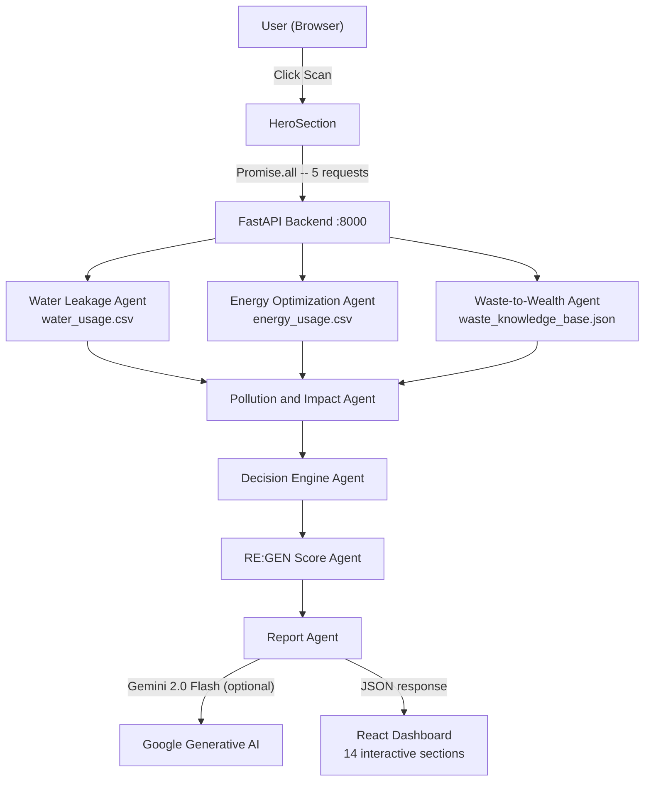
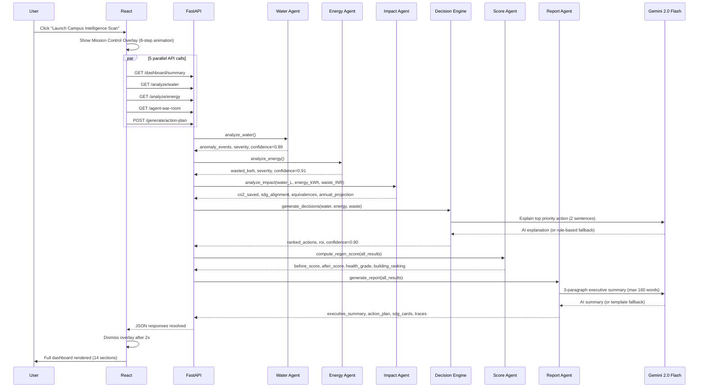

<p align="center">
  
</p>

<h1 align="center">RE:GEN AI</h1>
<h3 align="center">Autonomous Sustainability Command Center</h3>

<p align="center">
  A multi-agent decision-support prototype that detects hidden resource loss in simulated
  smart-campus sensor logs, maps waste-to-value pathways, and generates agent-prioritized
  sustainability interventions -- with optional Gemini 2.0 Flash AI reasoning layered on top.
</p>

<p align="center">
  
  
  
  
  
  
</p>

---

## The Problem RE:GEN AI Solves

Most university campuses lose thousands of rupees every week to hidden resource waste --
water pipes leaking at night when no one notices, HVAC running in empty labs, recyclable
materials discarded instead of recovered for value. No dashboard catches all three domains
together. No system tells you which problem to fix first, why, and what the financial and
environmental payoff is.

**RE:GEN AI sends agents, not alerts.**

Seven specialized agents analyze simulated 7-day campus resource logs, collaborate through
a structured pipeline, and produce a ranked action plan with carbon equivalences, ROI
estimates, and a 4-tier executive sustainability report -- all within seconds.

---

## What Is New in This Version

- **Gemini 2.0 Flash AI layer** -- Report Agent, Decision Engine, and Waste Agent call
  Gemini for narrative reasoning. Every call has a deterministic fallback so the system
  runs identically without an API key.
- **Campus Health Index** -- Letter grade A+ to F with label, color, and interpretation
  derived from 6 sustainability sub-dimensions.
- **CO2 Equivalences** -- Vehicle-km offset, household-days powered, flight fraction shown
  on the dashboard with educational context and source constants.
- **Annual Projection Strip** -- 52-week simulated projection clearly labeled as estimated.
- **SDG Alignment Cards** -- UN Goals 6, 7, 9, 12, 13 mapped with specific contribution
  statements generated per scan.
- **Building Risk Ranking** -- Per-building risk table merged from water and energy
  anomaly data across all monitored zones.
- **Storytelling Dashboard** -- Every metric answers: What is happening? Why? What next?
  What is the estimated impact?
- **War Room Pipeline Header** -- 3-phase sequential reveal (Rule Engine, Impact & Decision,
  AI Reasoning & Report) with per-card phase progress indicators.
- **PDF Print Export** -- window.print() with @media print CSS; no extra packages needed.
- **ROI Payback Estimates** -- Install cost divided by monthly saving in months, clearly
  labeled as simulated.

---

## System Architecture

```
User (Browser)
  |
  | Click "Launch Campus Intelligence Scan"
  v
React Frontend  (Vite + Tailwind CSS v4 + Recharts)
  |
  | Promise.all -- 5 parallel API calls
  v
FastAPI Backend  :8000
  |
  +-- Water Leakage Agent        water_usage.csv (168 rows)
  +-- Energy Optimization Agent  energy_usage.csv (168 rows)
  +-- Waste-to-Wealth Agent      waste_knowledge_base.json (30 materials)
  |
  +-- Pollution and Impact Agent  cross-domain CO2 + SDG + equivalences
  +-- Decision Engine Agent       urgency x cost x env x feasibility ranking
  +-- RE:GEN Score Agent          6-dimension weighted composite 0-100
  +-- Report Agent                executive summary + 4-tier action plan
               |
               | Optional AI layer (Gemini 2.0 Flash)
               | Graceful fallback if GEMINI_API_KEY not set
               v
      JSON response -> 14 interactive React sections
```

---

## Mermaid Architecture Diagram



---

## Request Flow



---

## The 7 Agents

| # | Agent | File | Confidence | AI-Enhanced | Key Output |
|---|-------|------|-----------|------------|-----------|
| 1 | Waste-to-Wealth | `waste_agent.py` | 0.92 | Yes | Recovery pathway, hidden value score, hazard guardrail, Gemini recommendation |
| 2 | Water Leakage | `water_agent.py` | 0.89 | No | Night-flow anomaly events, wasted litres, 5-tier severity |
| 3 | Energy Optimization | `energy_agent.py` | 0.91 | No | After-hours kWh waste per zone, CO2 at 0.82 kg/kWh |
| 4 | Pollution and Impact | `impact_agent.py` | 0.87 | No | CO2 kg, SDG alignment, vehicle/household/flight equivalences, annual projection |
| 5 | Decision Engine | `decision_agent.py` | 0.90 | Yes | Ranked actions by priority score, ROI payback months, Gemini priority explanation |
| 6 | RE:GEN Score | `regen_score_agent.py` | 0.88 | No | Before/after score, campus health grade, 6 sub-dimensions, building risk ranking |
| 7 | Report Agent | `report_agent.py` | 0.95 | Yes | Gemini executive summary, 4-tier action plan, SDG cards, all reasoning traces |

---

## Gemini AI Integration

RE:GEN AI uses Gemini 2.0 Flash as an optional reasoning layer. The system is fully
functional without it. Every Gemini call has a pre-computed deterministic fallback.

```python
# backend/core/gemini_client.py

def call_gemini(prompt: str, fallback: str = "") -> tuple[str, bool]:
    if not GEMINI_AVAILABLE or _model is None:
        return fallback, False       # rule-based fallback
    try:
        response = _model.generate_content(prompt)
        return response.text.strip(), True
    except Exception as exc:
        logging.warning(f"Gemini call failed, using fallback: {exc}")
        return fallback, False       # network or quota error -> fallback
```

**Where Gemini IS used:**
- Report Agent: 3-paragraph executive summary (max 160 words, prototype disclaimer required)
- Decision Engine: 2-sentence explanation of why the top action must be done first
- Waste Agent: 2-sentence actionable recovery recommendation (non-hazardous materials only)

**Where Gemini is NEVER used:**
- Hazardous waste: financial data stays suppressed regardless of AI availability
- Water and energy threshold calculations: always deterministic
- RE:GEN Score computation: always deterministic
- Any output claiming exact profit or live sensor data

All Gemini prompts contain embedded rules against forbidden phrases, financial exaggeration,
and sensor data misrepresentation.

---

## RE:GEN Score Formula

```
RE:GEN Score = waste_sub        x 0.20
             + water_sub        x 0.20
             + energy_sub       x 0.20
             + co2_sub          x 0.15
             + urgency_sub      x 0.15
             + feasibility_sub  x 0.10
```

Result clamped 0-100. Campus Health Grade:

| Score | Grade | Label |
|-------|-------|-------|
| >= 90 | A+ | Carbon-Neutral Ready |
| >= 80 | A  | High-Performing |
| >= 70 | B  | On Track |
| >= 55 | C  | Moderate Risk |
| >= 40 | D  | High Risk -- Act Now |
| < 40  | F  | Critical -- Immediate Escalation |

Decision Engine priority formula:

```
priority_score = urgency           x 0.35
              + min(cost/1000, 30) x 0.30
              + env_impact         x 0.25
              + feasibility        x 0.10
```

---

## Safety Guardrails

| Guardrail | Trigger | Effect |
|-----------|---------|--------|
| Hazard suppression | hazard_level critical or high | CPCB warning injected; all financials null |
| Quantity validation | quantity_kg <= 0 or > 100,000 | HTTP 400 before any agent runs |
| Disclaimer injection | Every response | Prototype disclaimer in all JSON responses |
| Sensor claim block | Always | Agents never claim live IoT or real-time data |
| Financial claim block | Always | Only "estimated" values; exact profit never claimed |
| Gemini guardrail | All Gemini prompts | Forbidden phrases and estimation rules embedded in every prompt |

Materials that trigger hazard suppression: **e-waste**, **battery waste**, **medical waste**.

---

## Dashboard Features (14 Sections)

| Section | What It Shows |
|---------|--------------|
| Hero | 176px logo centered, scan CTA, live agent network status card |
| Mission Control | 8-step cinematic scan overlay (parallel to API calls) |
| Command Center | 6 stat cards with What/Why/Next/Impact storytelling, CO2 equivalences, annual projection |
| RE:GEN Score Gauge | Animated SVG arc rings showing before and after intervention scores |
| Hidden Resource Loss | Water + energy + recoverable waste value in one card |
| Digital Twin Campus | Clickable 6-building map with per-zone risk diagnostics |
| Waste Analyzer | 30-material search, pathway scoring, hazard warnings, Gemini recommendation |
| Water Panel | Night-flow anomaly timeline, location table, severity indicators |
| Energy Panel | After-hours kWh per zone, CO2 contribution bar chart |
| Resource Loss Heatmap | Zone x domain risk grid, color-coded severity classes |
| Impact Projection | 30-day extrapolation with fix-rate display |
| Intervention Simulator | 6 toggles updating score + savings + CO2 instantly (no backend call) |
| Sustainability Achievements | 6 badge cards unlocking dynamically from scan results |
| Agent War Room | 3-phase pipeline header, sequential card reveal, per-card phase progress, live feed |
| Action Plan | 4-tier plan, Campus Health Index, SDG alignment cards, building risk table, PDF + JSON export |

---

## API Endpoints

| Method | Endpoint | Description |
|--------|----------|-------------|
| `GET` | `/health` | System status, Gemini availability, disclaimer |
| `POST` | `/analyze/waste` | Waste-to-Wealth Agent: material lookup, hazard check, Gemini recommendation |
| `GET` | `/analyze/water` | Water Leakage Agent: night-flow anomaly detection on 7-day CSV |
| `GET` | `/analyze/energy` | Energy Optimization Agent: after-hours waste detection per zone |
| `GET` | `/dashboard/summary` | Full pipeline compact summary for dashboard (fast path) |
| `GET` | `/agent-war-room` | All 7 agent status cards with findings and confidence scores |
| `POST` | `/generate/action-plan` | Full pipeline with Gemini: action plan, SDG, health index, exec summary |

Interactive docs: **http://localhost:8000/docs** (when backend is running)

---

## Tech Stack

### Backend

| Technology | Version | Purpose |
|-----------|---------|---------|
| FastAPI | 0.111.0 | API framework, CORS, Pydantic validation |
| Uvicorn | 0.29.0 | ASGI server |
| Pandas | 2.2.2 | CSV data processing |
| Pydantic | 2.7.1 | Request/response models |
| google-generativeai | 0.8.0+ | Gemini 2.0 Flash API client |
| python-dotenv | 1.0.0+ | .env file loading for API key |

### Frontend

| Technology | Version | Purpose |
|-----------|---------|---------|
| React | 19.2.7 | UI library |
| Vite | 8.1.0 | Build tool with /api proxy |
| Tailwind CSS v4 | 4.3.1 | Utility-first styling (no PostCSS, @tailwindcss/vite) |
| Recharts | 3.9.0 | SVG charts |
| Lucide React | 1.21.0 | Icon system |
| Axios | 1.18.1 | HTTP client (VITE_API_URL support for deployment) |

---

## Project Structure

```
REGEN AI/
|-- backend/
|   |-- main.py                       FastAPI routes, CORS, Pydantic models
|   |-- requirements.txt
|   |-- .env.example                  Copy to .env and add GEMINI_API_KEY
|   |-- agents/
|   |   |-- waste_agent.py            30-material KB, hazard guardrail, Gemini rec
|   |   |-- water_agent.py            Night-flow anomaly detection
|   |   |-- energy_agent.py           After-hours zone analysis
|   |   |-- impact_agent.py           CO2, SDG, vehicle/household equivalences
|   |   |-- decision_agent.py         Priority scoring, ROI, Gemini explanation
|   |   |-- regen_score_agent.py      6-dimension score, health grade, building rank
|   |   `-- report_agent.py           Gemini exec summary, 4-tier action plan
|   |-- core/
|   |   |-- gemini_client.py          Gemini 2.0 Flash + graceful fallback
|   |   |-- scoring.py                RE:GEN Score formula
|   |   |-- guardrails.py             Hazard suppression, disclaimer constants
|   |   `-- simulation.py             CSV and JSON data loaders
|   `-- data/
|       |-- water_usage.csv           168 rows, Jan 15-21 2024, 4 locations
|       |-- energy_usage.csv          168 rows, Jan 15-21 2024, 4 zones
|       `-- waste_knowledge_base.json 30 materials, 7 categories
`-- frontend/
    |-- vite.config.js                Tailwind v4 plugin; /api proxy to :8000
    |-- package.json
    `-- src/
        |-- App.jsx                   Scan state, Mission Control, 14 sections
        |-- api.js                    7 Axios functions, VITE_API_URL for deployment
        |-- index.css                 Glassmorphism system, 20+ animations, print CSS
        `-- components/               15 React components
```

---

## Quick Start -- Running in the Terminal

### Requirements

- Python 3.11 or higher
- Node.js 18 or higher
- npm 9 or higher

### Step 1 -- Clone the repository

```bash
git clone https://github.com/DivyaShreeS09/REGEN-AI.git
cd "REGEN AI"
```

### Step 2 -- Set up the Python backend

```bash
cd backend

# Create a virtual environment (recommended)
python -m venv venv

# Activate it
# On Windows:
venv\Scripts\activate
# On macOS / Linux:
source venv/bin/activate

# Install dependencies
pip install -r requirements.txt
```

### Step 3 -- (Optional) Enable Gemini AI

```bash
# Copy the example env file
cp .env.example .env
```

Edit `.env` and paste your key:

```
GEMINI_API_KEY=your_api_key_here
```

Get a free Gemini API key at: https://aistudio.google.com/app/apikey

The app works fully without a key. Gemini adds AI narrative on top of deterministic analysis.

### Step 4 -- Start the backend server (Terminal 1)

```bash
# From the backend/ directory with venv activated
uvicorn main:app --reload --port 8000
```

You should see:
```
INFO:     Uvicorn running on http://127.0.0.1:8000 (Press CTRL+C to quit)
INFO:     Application startup complete.
```

### Step 5 -- Start the frontend (Terminal 2, new window)

```bash
cd frontend
npm install
npm run dev
```

You should see:
```
  VITE v8.x.x  ready in xxx ms
  -> Local:   http://localhost:5173/
```

### Step 6 -- Open the app

Navigate to: **http://localhost:5173**

Click **"Launch Campus Intelligence Scan"** on the hero page.

The Mission Control overlay appears for approximately 4 seconds while all agents run.
All 14 dashboard sections then load with animated data.

Interactive API docs: **http://localhost:8000/docs**

---

## Simulated Data

All data is simulated for capstone demonstration. No live IoT systems are connected.

| Dataset | Rows | Embedded Anomalies |
|---------|------|--------------------|
| `water_usage.csv` | 168 | Night-flow burst Jan 16 Block-B Hostel (HIGH), Jan 19 Lab Block (CRITICAL) |
| `energy_usage.csv` | 168 | After-hours AC Jan 16 Seminar Hall (HIGH), Jan 19 Computer Lab (CRITICAL) |
| `waste_knowledge_base.json` | 30 materials | e-waste, battery waste, medical waste flagged critical/hazardous |

Data covers January 15-21, 2024. Each CSV has 24 hourly readings x 7 days = 168 rows.

---

## Deployment Guide

### Option A -- Render (backend) + Vercel (frontend) -- Free Tier

**1. Deploy backend to Render.com**

- Go to https://render.com and sign in with GitHub.
- Click New -> Web Service -> connect your REGEN-AI repository.
- Configure:
  - Root directory: `backend`
  - Runtime: Python 3
  - Build command: `pip install -r requirements.txt`
  - Start command: `uvicorn main:app --host 0.0.0.0 --port $PORT`
  - Environment variable: `GEMINI_API_KEY` = your key (optional)
- Deploy. You will receive a URL like `https://regen-ai-backend.onrender.com`.

**2. Deploy frontend to Vercel**

- Go to https://vercel.com and sign in with GitHub.
- Click New Project -> Import REGEN-AI repository.
- Configure:
  - Framework preset: Vite
  - Root directory: `frontend`
  - Build command: `npm run build`
  - Output directory: `dist`
  - Environment variable: `VITE_API_URL` = `https://regen-ai-backend.onrender.com`
- Deploy. You will receive a URL like `https://regen-ai.vercel.app`.

> Important: The Vite dev proxy (/api -> localhost:8000) only works locally. In production,
> VITE_API_URL tells the frontend where the real backend is. This is already handled in
> frontend/src/api.js via `import.meta.env.VITE_API_URL || '/api'`.

> Render free tier spins down after 15 minutes of inactivity. First request after spin-down
> takes 30-60 seconds. This is a Render free tier limitation, not a code issue.

---

### Option B -- Local production build

```bash
# Build the frontend for production
cd frontend
npm run build
# Output goes to frontend/dist/

# Start the backend (serves API on :8000)
cd ../backend
uvicorn main:app --host 0.0.0.0 --port 8000

# Serve the built frontend with any static file server, for example:
npx serve ../frontend/dist -p 3000
```

---

## Google AI Agents Capstone Mapping

| Concept | RE:GEN AI Implementation |
|---------|--------------------------|
| Multi-Agent System | 7 specialized agents in `backend/agents/`, one Python module each |
| Tool Use / Data Retrieval | Pandas CSV loader, JSON knowledge base (cached on first load), Gemini API |
| Agent Reasoning | 7-step auditable reasoning trace per agent returned in every API response |
| Gemini AI Integration | Gemini 2.0 Flash called from 3 agents with graceful deterministic fallback |
| Guardrails and Safety | Hazard suppression, quantity validation, disclaimer injection, Gemini prompt rules |
| Evaluation and Scoring | 6-dimension weighted RE:GEN Score (0-100), per-agent confidence 0.87-0.95 |
| Multi-Domain Analysis | Water, Energy, Waste analyzed independently then synthesized by Impact Agent |
| Impact Quantification | CO2 kg, vehicle-km offset, household-days, 52-week annual projection |
| SDG Alignment | SDG 6, 7, 9, 12, 13 each with specific contribution statement per scan |
| Decision Support | 4-tier action plan (24h / 7d / 30d / 12m+) with ROI payback month estimates |
| Production Structure | FastAPI + Pydantic + CORS + React 19 + Vite 8 + Tailwind CSS v4 + Recharts |

---

## Known Limitations

This is a capstone prototype. The following are clearly disclosed in the UI:

- All data is simulated (January 15-21, 2024). No live IoT systems are connected.
- Financial values use standard utility rates (Rs. 0.05/L water, Rs. 8.00/kWh), not actual bills.
- CO2 equivalences use published averages as educational analogies, not precise campus baselines.
- Annual projections assume the same weekly loss rate sustained for 52 weeks with no intervention.
- ROI payback months use assumed install costs (clearly labeled as simulated estimates).
- Campus Health Grade is derived from simulated data only, not an official accreditation.
- Gemini AI narrative is probabilistic; the rule engine output underneath is always deterministic.

---

## Contributing

1. Fork and create a branch: `git checkout -b feature/your-feature`
2. Backend changes in `backend/`, frontend in `frontend/`
3. New agents: add a file to `backend/agents/` and wire it into `main.py`
4. Do not weaken guardrail logic in `core/guardrails.py`
5. All API responses must include `disclaimer` and `data_notice` fields
6. Gemini prompts must include forbidden-phrase and "estimated values only" rules in the prompt body
7. Run `cd frontend && npm run build` before opening a PR

---

> **Disclaimer:** RE:GEN AI is a prototype decision-support system built for the Google Kaggle
> AI Agents Capstone (June 2026). All sensor data is simulated (January 15-21, 2024).
> No live IoT systems are connected. All cost, CO2, and recovery figures are estimates.
> This is not professional regulatory, financial, or engineering advice.
