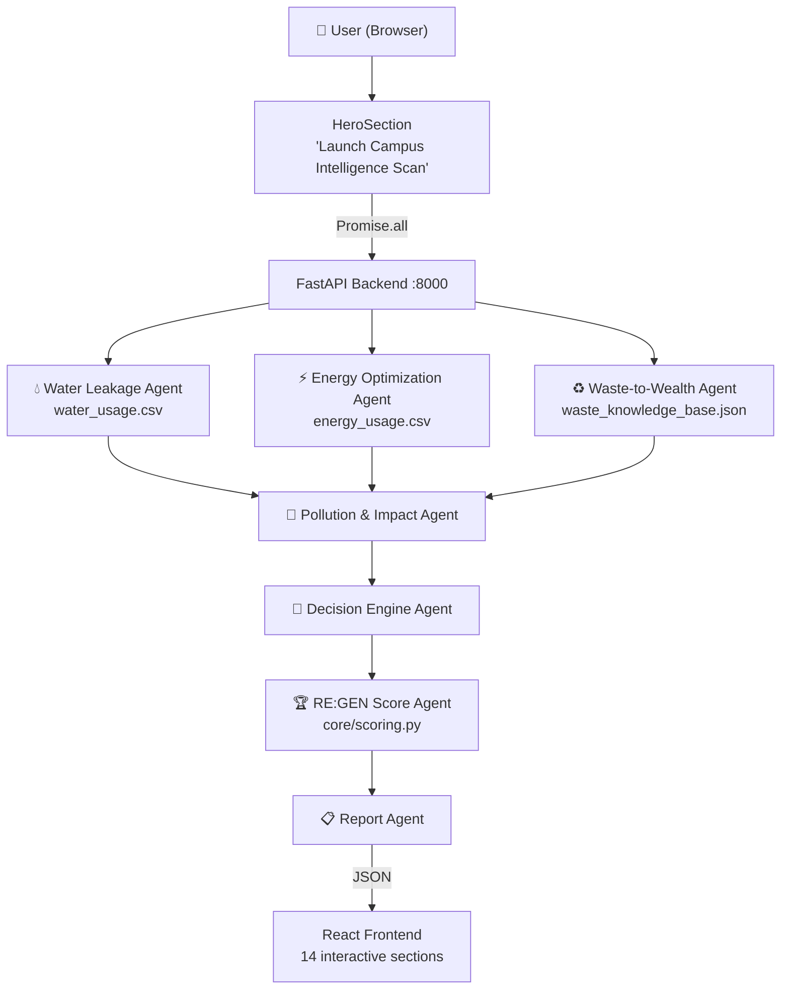
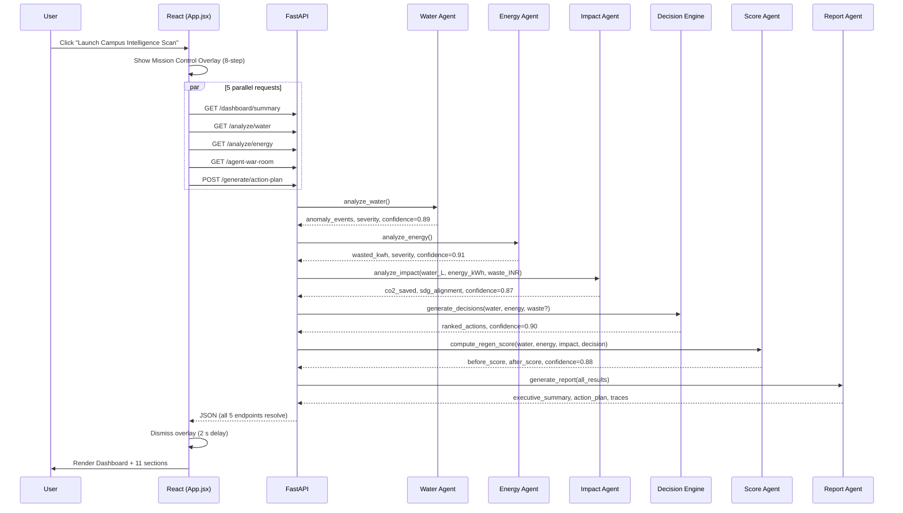
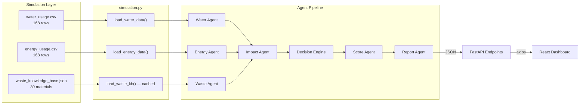
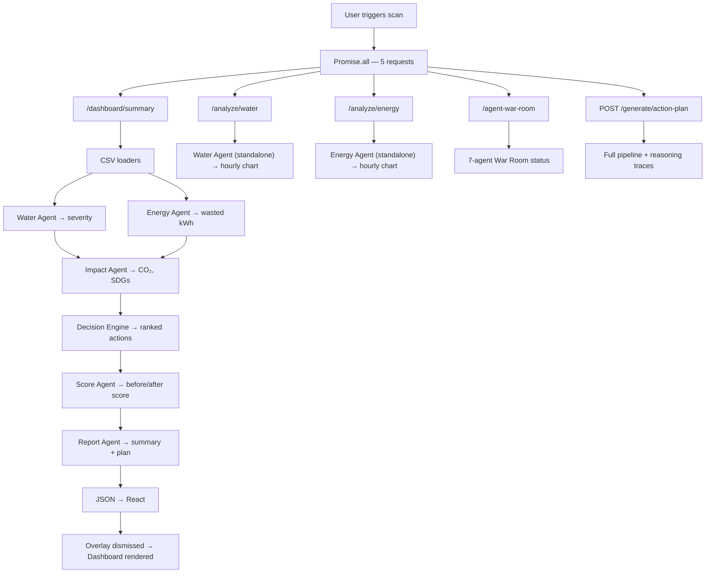
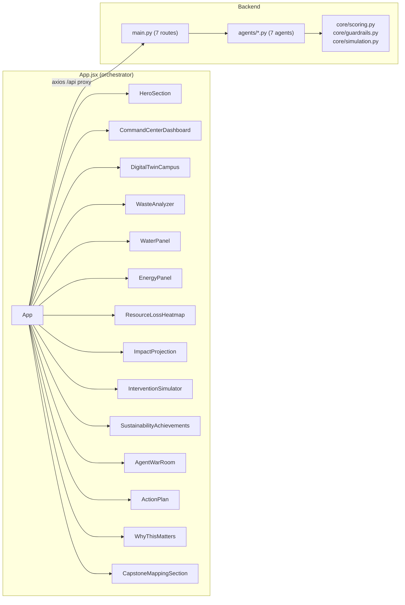

# System Flowcharts

All diagrams use [Mermaid](https://mermaid.js.org/) syntax and render natively on GitHub.

---

## 1. High-Level System Architecture

---

## 2. Request Sequence

---

## 3. Data Flow

---

## 4. Complete Request Flow

---

## 5. React Component Architecture

---

*See also: [ARCHITECTURE.md](ARCHITECTURE.md) · [AGENTS.md](AGENTS.md)*
